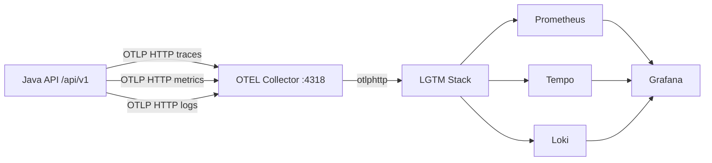

# Arquitetura

## Visao geral

A aplicacao roda no host local e exporta telemetria OTLP HTTP para o OpenTelemetry Collector.
O Collector processa e encaminha para a stack LGTM (Prometheus, Tempo, Loki, Grafana).

Componentes:

- `java-api-with-otlp-sdk` (Spring Boot)
- `otel-collector` (receiver/process/export)
- `grafana/otel-lgtm` (backend de observabilidade + Grafana)

## Fluxo de sinais



## Endpoints e padrao de path

Padrao de path da API funcional:

- `IP:PORTA/api/v1/<endpoint>`

Exemplos:

- `/api/v1/health`
- `/api/v1/hello`
- `/api/v1/users`

Documentacao OpenAPI:

- `/api/v1/api-docs`
- `/api/v1/swagger-ui`
- `/api/v1/redoc`

## Recursos OTEL da aplicacao

A API envia atributos de recurso para correlacao:

- `service.name`
- `service.version`
- `deployment.environment`
- `service.instance.id`

## Observacao sobre dashboards default do LGTM

Alguns dashboards built-in podem nao refletir bem nomes de metricas do Micrometer.
Por isso o projeto cria dashboards compativeis via:

```bash
make observability-dashboards
```
